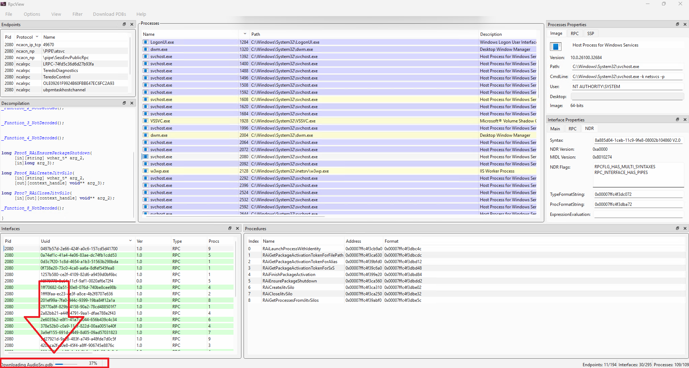
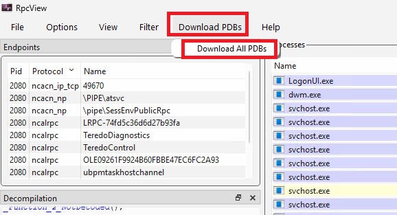

# RpcView

RpcView is an open-source tool to explore and decompile all RPC functionalities present on a Microsoft system.

This fork runs on current Windows 11 and builds with Qt 6. The two sections below are the main changes.
Build and runtime notes, then the original compile instructions, follow them.
The same notes are in [CHANGES.md](CHANGES.md).

## Procedure names

The default symbol path is already set, so you do not need to configure it:

`srv*C:\Symbols*https://msdl.microsoft.com/download/symbols`

`C:\Symbols` is the local cache. The address after the second `*` is the Microsoft symbol server.
Options → Configure Symbols shows this path until you save a different one.

Added: the bottom-left bar names the PDB that is downloading and a percent from 0 to 100.
In the picture the bar reads `Downloading AudioSrv.pdb` at 37%.

Click an interface after its PDB is on disk. The Procedures pane then shows the real function names.
`RAILaunchProcessWithIdentity` is an example. In the picture, `appinfo.dll` shows that name
and the other `RAI*` calls.

One dbghelp session stays open for the life of the window. Clicking an interface does not call `SymCleanup`.
A module is loaded from its DLL path. Missing PDBs download on a background thread.
A compressed or failed download falls back to a hidden `RpcView.exe /symfetch` process.



## Download PDBs menu

**Download PDBs** is on the menu bar, between Filter and Help. **Download All PDBs** asks
"Are you sure you want to download all PDBs?" No is the default.
Yes queues only PDB files that are not already under `C:\Symbols`.
The scan runs off the UI thread. Auto-refresh stops while that question is open and while the scan runs,
so the window does not show as not responding.



## Also in this fork

- RpcCore4 accepts the Windows 11 `rpcrt4.dll` file version used here, so the tool loads RpcCore4
  instead of stopping on an unknown runtime.
- `ntdll.dll` is loaded with `GetModuleHandleA`. The UNICODE build was crashing at startup.
- CMake targets Qt 6 Widgets and C++17. `RpcView/WinIcon.h` replaces `QtWin::fromHICON`.
- Widgets that used `QRegExp` now use `QRegularExpression`.

You can download the last upstream [automatically built release](https://ci.appveyor.com/project/silverf0x/rpcview/build/artifacts).
That build does not include the changes above.

[](https://ci.appveyor.com/project/silverf0x/rpcview)

> **Warning**: you have to install "Microsoft Visual C++ 2019 Redistributable" to use RpcView.

## How to add a new RPC runtime

Basically you have two possibilities to support a new RPC runtime (rpcrt4.dll) version:

- The easy way: just edit the RpcInternals.h file in the corresponding RpcCore directories (32 and 64-bit versions) to add your runtime version in the RPC_CORE_RUNTIME_VERSION table.
- The best way: reverse the rpcrt4.dll to define the required structures used by RpcView, e.g. RPC_SERVER, RPC_INTERFACE and RPC_ADDRESS.

Currently, the supported versions are organized as follows:

- RpcCore1 for Windows XP
- RpcCore2 for Windows 7
- RpcCore3 for Windows 8
- RpcCore4 for Windows 8.1 and 10

## Compilation

Required elements to compiled the project:

* Visual Studio (currently Visual Studio 2019 Community)
* CMake (currently 3.13.2)
* Qt5 (currently 5.15.2)

Before running CMake you have to set the CMAKE_PREFIX_PATH environment variable with the Qt **full path**, for instance (x64):
```
set CMAKE_PREFIX_PATH=C:\Qt\5.15.2\msvc2019_64\
```
Before running CMake to produce the project solution you have to create the build directories:
- ```RpcView/Build/x64``` for 64-bit targets
- ```RpcView/Build/x86``` for 32-bit targets.

Here is an example to generate the x64 solution with Visual Studio 2019 from the ```RpcView/Build/x64``` directory:

```cmake
cmake ../../ -A x64
-- Building for: Visual Studio 16 2019
-- Selecting Windows SDK version 10.0.17763.0 to target Windows 10.0.19041.
-- The C compiler identification is MSVC 19.28.29334.0
-- The CXX compiler identification is MSVC 19.28.29334.0
-- Check for working C compiler: C:/Program Files (x86)/Microsoft Visual Studio/2019/Community/VC/Tools/MSVC/14.28.29333/bin/Hostx64/x64/cl.exe
-- Check for working C compiler: C:/Program Files (x86)/Microsoft Visual Studio/2019/Community/VC/Tools/MSVC/14.28.29333/bin/Hostx64/x64/cl.exe -- works
-- Detecting C compiler ABI info
-- Detecting C compiler ABI info - done
-- Detecting C compile features
-- Detecting C compile features - done
-- Check for working CXX compiler: C:/Program Files (x86)/Microsoft Visual Studio/2019/Community/VC/Tools/MSVC/14.28.29333/bin/Hostx64/x64/cl.exe
-- Check for working CXX compiler: C:/Program Files (x86)/Microsoft Visual Studio/2019/Community/VC/Tools/MSVC/14.28.29333/bin/Hostx64/x64/cl.exe -- works
-- Detecting CXX compiler ABI info
-- Detecting CXX compiler ABI info - done
-- Detecting CXX compile features
-- Detecting CXX compile features - done
[RpcView]
[RpcDecompiler]
[RpcCore1_32bits]
[RpcCore2_32bits]
[RpcCore2_64bits]
[RpcCore3_32bits]
[RpcCore3_64bits]
[RpcCore4_32bits]
[RpcCore4_64bits]
-- Configuring done
-- Generating done
-- Build files have been written to: C:/Dev/RpcView/Build/x64
```

To produce the Win32 solution:
```
set CMAKE_PREFIX_PATH=C:\Qt\5.15.2\msvc2019
```
Then from the ```RpcView/Build/x86``` directory:
```cmake
cmake ../../ -A win32
-- Building for: Visual Studio 16 2019
-- Selecting Windows SDK version 10.0.17763.0 to target Windows 10.0.19041.
-- The C compiler identification is MSVC 19.28.29334.0
-- The CXX compiler identification is MSVC 19.28.29334.0
-- Check for working C compiler: C:/Program Files (x86)/Microsoft Visual Studio/2019/Community/VC/Tools/MSVC/14.28.29333/bin/Hostx64/x86/cl.exe
-- Check for working C compiler: C:/Program Files (x86)/Microsoft Visual Studio/2019/Community/VC/Tools/MSVC/14.28.29333/bin/Hostx64/x86/cl.exe -- works
-- Detecting C compiler ABI info
-- Detecting C compiler ABI info - done
-- Detecting C compile features
-- Detecting C compile features - done
-- Check for working CXX compiler: C:/Program Files (x86)/Microsoft Visual Studio/2019/Community/VC/Tools/MSVC/14.28.29333/bin/Hostx64/x86/cl.exe
-- Check for working CXX compiler: C:/Program Files (x86)/Microsoft Visual Studio/2019/Community/VC/Tools/MSVC/14.28.29333/bin/Hostx64/x86/cl.exe -- works
-- Detecting CXX compiler ABI info
-- Detecting CXX compiler ABI info - done
-- Detecting CXX compile features
-- Detecting CXX compile features - done
[RpcView]
[RpcDecompiler]
[RpcCore1_32bits]
[RpcCore2_32bits]
[RpcCore3_32bits]
[RpcCore4_32bits]
-- Configuring done
-- Generating done
-- Build files have been written to: C:/Dev/RpcView/Build/x86
```
Now you can compile the solution with Visual Studio or CMAKE:

```cmake
cmake --build . --config Release
```

RpcView32 binaries are produced in the ```RpcView/Build/bin/x86``` directory and RpcView64 ones in the ```RpcView/Build/bin/x64```

## Acknowledgements

* Jeremy
* Julien
* Yoanne
* Bruno
